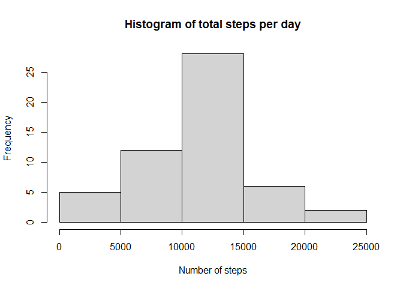
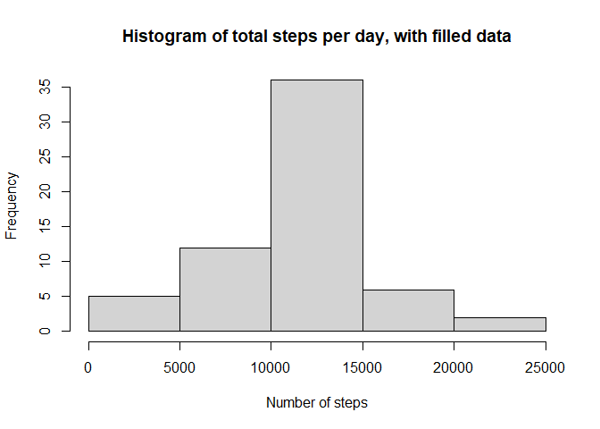
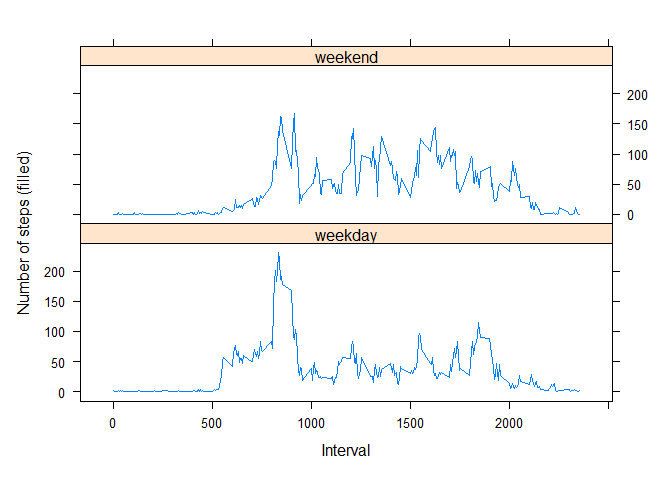

## 1. Loading and preprocessing the data


```r
df<-read.csv("activity.csv")

library(lubridate)
```

```
## 
## Attaching package: 'lubridate'
```

```
## The following objects are masked from 'package:base':
## 
##     date, intersect, setdiff, union
```

```r
df$date<-as_date(df$date)
```

## 2. What is mean total number of steps taken per day?

Histogram of the total number of steps taken each day:

```r
df_days<-aggregate(steps ~ date, data=df, FUN='sum')
hist(df_days$steps, main="Histogram of total steps per day", xlab="Number of steps")
```

<!-- -->

The mean and median total number of steps taken per day:

```r
mean(df_days$steps)
```

```
## [1] 10766.19
```

```r
median(df_days$steps)
```

```
## [1] 10765
```

## 3. What is the average daily activity pattern?

Time series plot (i.e. type = "l") of the 5-minute interval (x-axis) and the average number of steps taken, averaged across all days (y-axis):

```r
df_interval<-aggregate(steps ~ interval, data=df, FUN='mean')
plot(df_interval,type="l")
```

<!-- -->

The 5-minute interval, which on average across all the days in the dataset, contains the maximum number of steps:


```r
library(dplyr)
```

```
## 
## Attaching package: 'dplyr'
```

```
## The following objects are masked from 'package:stats':
## 
##     filter, lag
```

```
## The following objects are masked from 'package:base':
## 
##     intersect, setdiff, setequal, union
```

```r
df_interval %>% filter(steps==max(steps))
```

```
##   interval    steps
## 1      835 206.1698
```

## 4. Inputing missing values

Calculate and report the total number of missing values in the dataset.

```r
sum(is.na(df$steps))
```

```
## [1] 2304
```

Devise a strategy for filling in all of the missing values in the dataset. Fill with interval mean if missing.

```r
getinterval_av<-df_interval$steps
names(getinterval_av)<-df_interval$interval
```
Create a new dataset that is equal to the original dataset but with the missing data filled in.

```r
df<-mutate(df, "interval_av" = getinterval_av[as.character(interval)])
df<-mutate(df, "steps_filled"=ifelse(is.na(steps), interval_av, steps))
```

Histogram of the total number of steps taken each day:

```r
df_days_filled<-aggregate(steps_filled ~ date, data=df, FUN='sum')
hist(df_days_filled$steps_filled, main="Histogram of total steps per day, with filled data", xlab="Number of steps")
```

<!-- -->

The mean and median total number of steps taken per day:

```r
mean(df_days_filled$steps_filled)
```

```
## [1] 10766.19
```

```r
median(df_days_filled$steps_filled)
```

```
## [1] 10766.19
```

Do these values differ from the estimates from the first part of the assignment? What is the impact of inputing missing data on the estimates of the total daily number of steps?

```r
results <- matrix(1:6, nrow = 2, dimnames = list(c("mean","median"), c("Original","Filled", "Change")))
results[1,1]<-mean(df_days$steps)
results[1,2]<-mean(df_days_filled$steps_filled)
results[2,1]<-median(df_days$steps)
results[2,2]<-median(df_days_filled$steps_filled)
results[1,3]<-results[1,2]-results[1,1]
results[2,3]<-results[2,2]-results[2,1]
results
```

```
##        Original   Filled   Change
## mean   10766.19 10766.19 0.000000
## median 10765.00 10766.19 1.188679
```

## 5. Are there differences in activity patterns between weekdays and weekends?

Create a new factor variable in the dataset with two levels – “weekday” and “weekend” indicating whether a given date is a weekday or weekend

```r
df<-mutate(df, "day_type"=ifelse(weekdays(date)=='Saturday' | weekdays(date)=='Sunday', "weekend", "weekday"))
```

Panel plot containing a time series plot (i.e. type = "l") of the 5-minute interval (x-axis) and the average number of steps taken, averaged across all weekday days or weekend days (y-axis).

```r
df_type<-aggregate(steps_filled ~ interval + day_type, data=df, FUN='mean')
library(lattice)
xyplot(steps_filled ~ interval| day_type, df_type, layout=c(1,2), type="l", xlab="Interval", ylab="Number of steps (filled)")
```

<!-- -->
